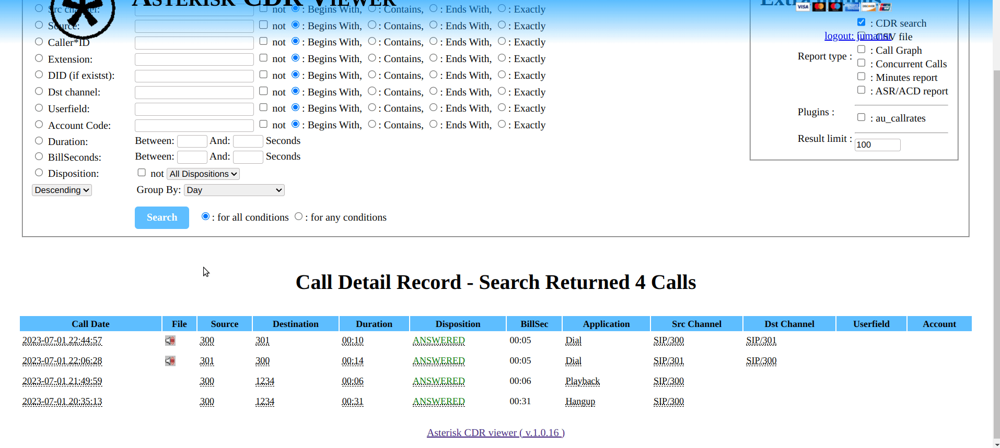

# Asterisk CDR viewer

This application is a simple and fast viewer for Asterisk CDRs / recordings. 
It's a fork of the original [asterisk-cdr-viewer](https://github.com/g613/asterisk-cdr-viewer) with some adaptations:

* Supports HTML5 (Audio Native)
* Tested with [Issabel](https://www.issabel.org/) and [FreePbx](https://www.freepbx.org/) 

## Installation

Installation in the following [link](https://www.youtube.com/watch?v=ePOW4Ic2-oU)

## Example

## Key features

    Asterisk regexp support ( like _XNZ. ) for source / destination / DID numbers. 

    PHP without any additional dependencies. 

    Easy to install and use. 

    CSS based. 

    User / Admin mode 

    Plugins support for custom reports. 

    ASR report 

## Screenshots

( from http://code.google.com/p/asterisk-cdr-viewer )
